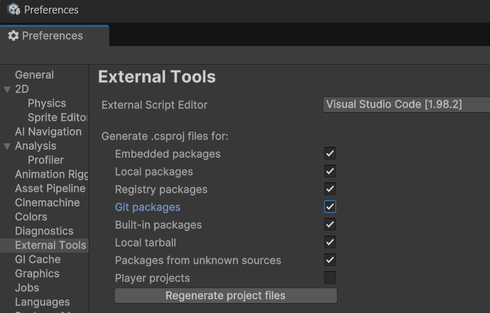

# 3DARPG

## バージョン

- Unity Editor 6000.0.24f1


## 環境構築
1. 任意の場所にクローンする  
```git clone https://github.com/TN-2001/3DARPG.git```

1. [公式サイト](https://unity.com/ja/download)からUnity Hubをダウンロード

1. Unity Hubを起動して、Projectsに移動する

1. 右上のAddから`Add project from disk`を選択して、クローンした`3DARPG`を選択する

1. 指定されたバージョンのUnity Editorをダウンロードする

1. プロジェクトの一覧から3DARPGを選択して起動する

## csprojファイルを再生成する方法
1. EditからPreferencesを選択
1. External Toolsを選択
1. Regenerate csproj filesを選択

